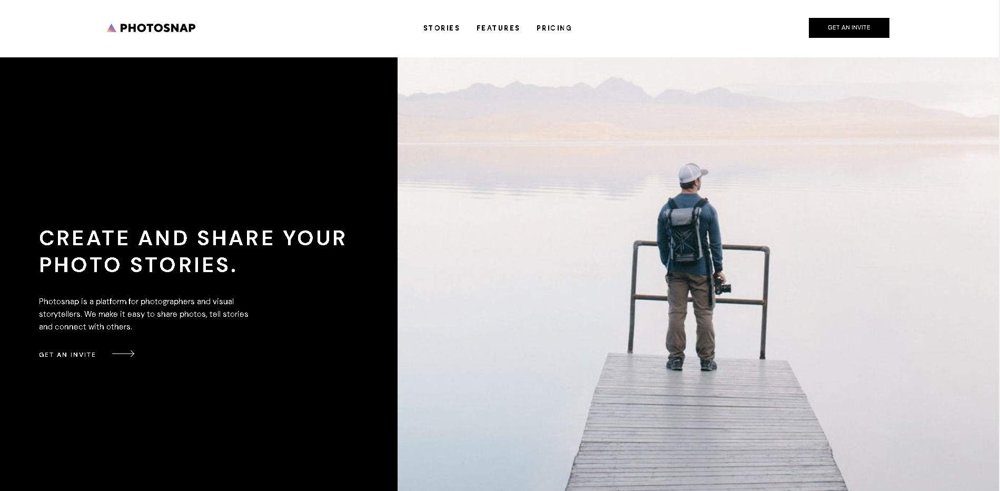

# Frontend Mentor - Photosnap Website solution

This is a solution to the [Photosnap Website challenge on Frontend Mentor](https://www.frontendmentor.io/challenges/photosnap-multipage-website-nMDSrNmNW). Frontend Mentor challenges help you improve your coding skills by building realistic projects. 

## Table of contents

  - [The challenge](#the-challenge)
  - [Screenshot](#screenshot)
  - [Links](#links)
- [My process](#my-process)
  - [Built with](#built-with)
  - [What I learned](#what-i-learned)
  - [Continued development](#continued-development)
  - [Useful resources](#useful-resources)
- [Author](#author)

### The challenge

Users should be able to:

- View the optimal layout for each page depending on their device's screen size.
- See hover states for all interactive elements throughout the site.

### Screenshot

### Links

- Live Site URL: [Add live site URL here](https://your-live-site-url.com)

## My process

- I studied the figma file to work out how to lay out the pages, which sections should be laid out in Flexbox or CSS Grid.
- From the Figma file I also figured out the CSS variables to use and set up utility classes for the site. 
- I used the mobile first approach, but the HTML was coded from the desktop layout whilst the CSS was done from mobile up!
- I set up the layout for each page and then did each section separately in mobile, tablet and then desktop.
- I decided to leave all hover states for the navigation section and the footer on all pages. I also changed the navigation headings on the extra pages to reflect how  it would work if it was a 'real' website. The figma design provided only used the homepage navigation template for all the pages. I therefore had to customise the navigation for each page so that if you clicked on a link it would take you to the correct page.

### Built with

- Semantic HTML5 markup
- CSS custom properties
- Flexbox
- CSS Grid
- Mobile-first workflow
- Javascript 

### What I learned

This challenge was a test of my CSS Grid and Flexbox skills. After completing it I feel a lot more comfortable with CSS Grid and Flexbox for laying out the pages and the individual sections. My css is flowing more naturrally and I understand better what I have to do when I encounter any issues I can't fix at first try. A good tip is to move on to something else while your mind is solving the issue in the background! It really works even though it may take a day or two to crystalise!

Svgs were used a lot throughout the site, particularly in the social links hover states, and when moving svgs around in the grid container. I was experiencing some issues here and after spending a lot of time researching how to solve them I had to settle for some self made hacks that aren't completely like the figma design but still works well! The one take from this project is that I will have to study more on how to use and work with SVGs.

### Continued development

I am eager to do more similar projects and improve more. Still need to work on my Javascript as sometimes I overcomplicate things!

### Useful resources

- [CSS Flex & Grid, Complete Guide with Real World Examples and Code Snippets. An e-book by Shruti Balasa](https://www..shrutibalasa.com) - This helped me with the header and footer navs and understanding how to align the flex or grid items correctly. Highly recommended!

## Author

- Website - [Annie Indreiten](https://www.your-site.com)
- LinkedIn - https://www.linkedin.com/in/annie-indreiten777/

